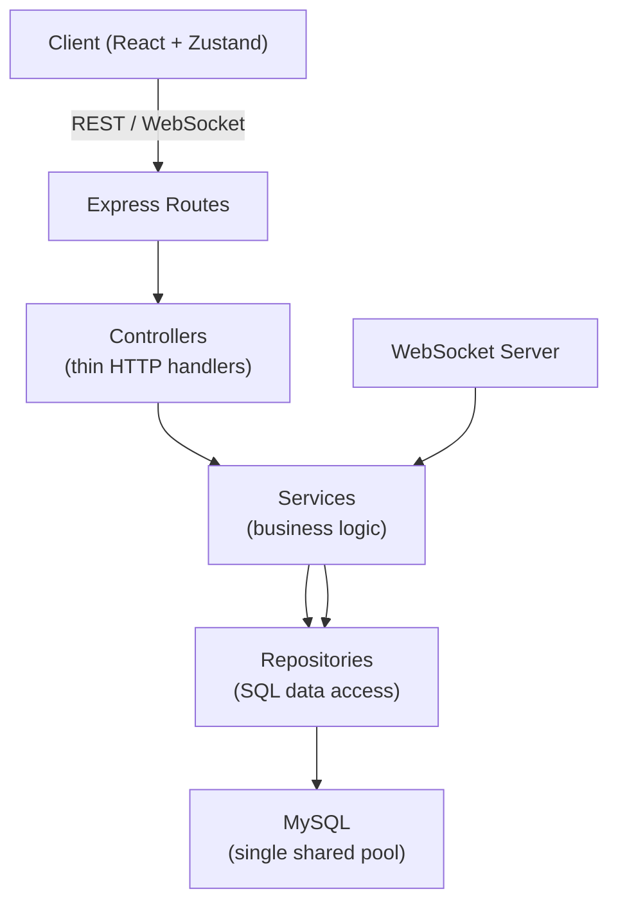
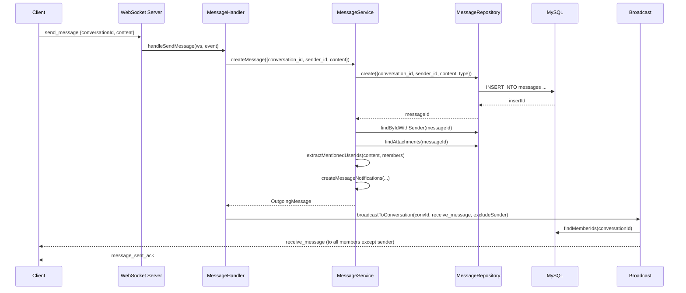
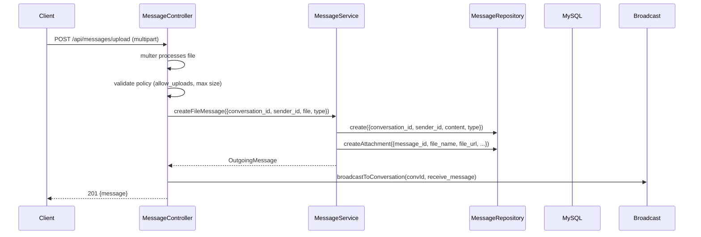
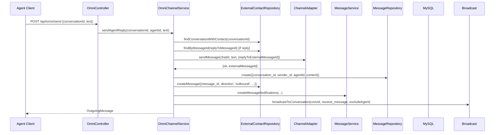
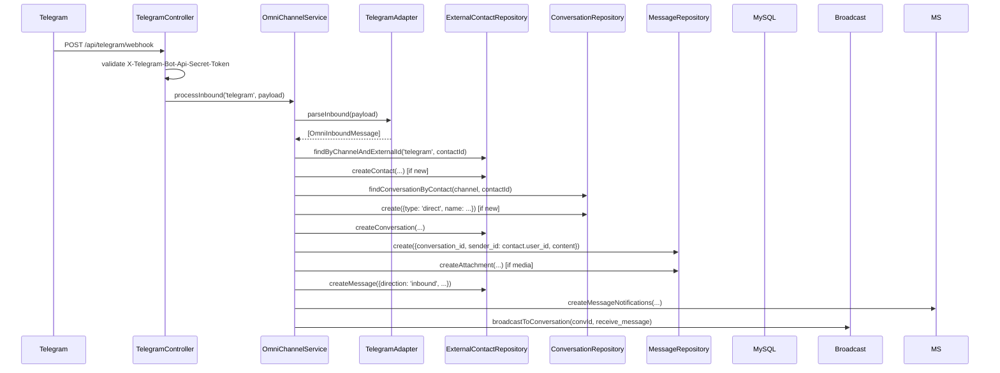
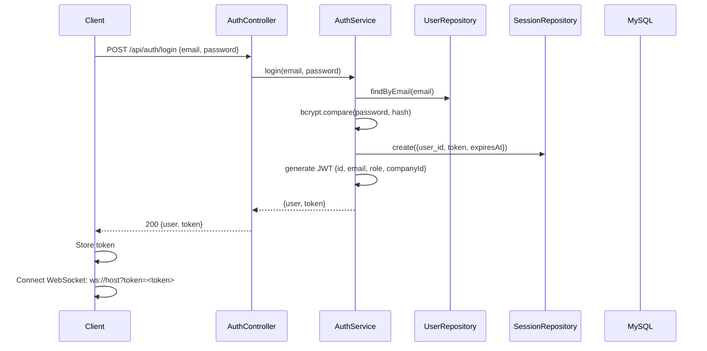
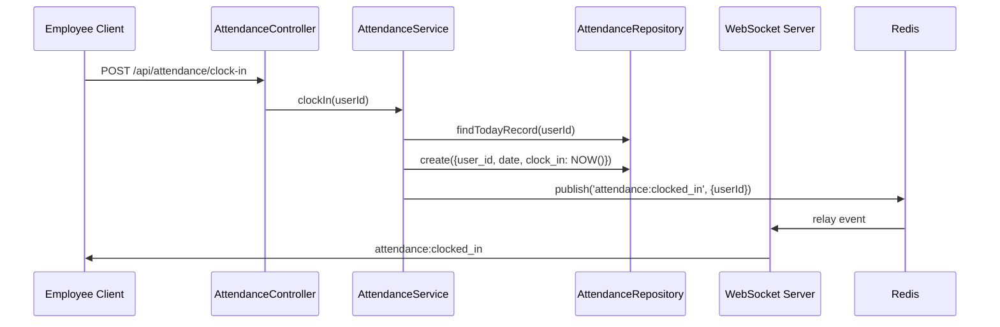
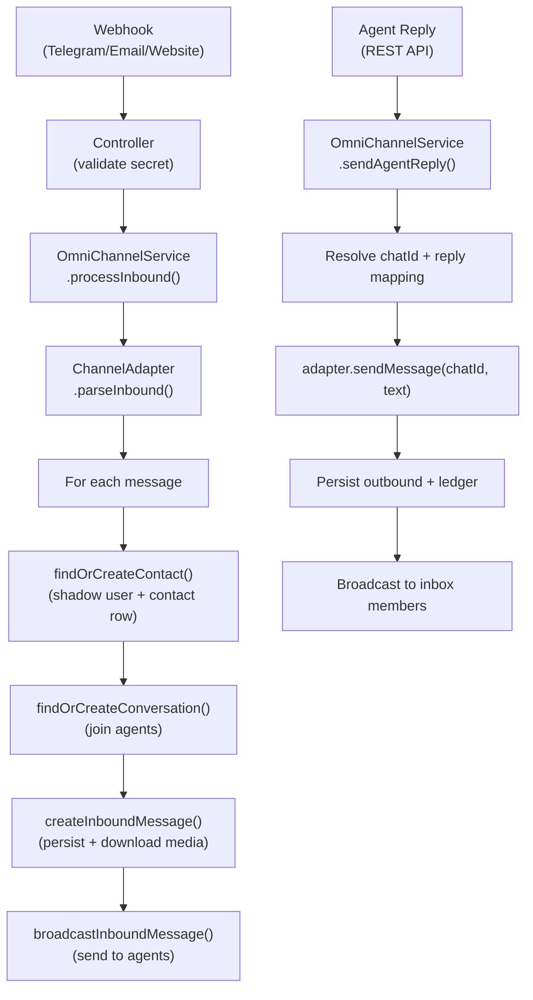

# KneaChat — Backend Project Structure & Workflow

> **Scope:** Express + WebSocket backend only  
> **Stack:** Node.js 24 + Express + WebSocket (`ws`) + MySQL + Redis  
> **Generated:** 2026-09-22

---

## Contents

- [1. Backend Directory Structure](#1-backend-directory-structure)
- [2. Layer Architecture](#2-layer-architecture)
- [3. Composition Root (DI)](#3-composition-root-di)
- [4. Request Lifecycle — REST](#4-request-lifecycle--rest)
- [5. Request Lifecycle — WebSocket](#5-request-lifecycle--websocket)
- [6. Key Backend Workflows](#6-key-backend-workflows)
- [7. Omni-Channel Backend Workflow](#7-omni-channel-backend-workflow)
- [8. Background Schedulers](#8-background-schedulers)
- [9. Cross-Cutting Concerns](#9-cross-cutting-concerns)
- [10. Database Layer](#10-database-layer)
- [11. Error Handling](#11-error-handling)
- [12. Testing Strategy (Backend)](#12-testing-strategy-backend)

---

## 1. Backend Directory Structure

```
server/
├── package.json
├── tsconfig.json
├── .env                        # Runtime secrets
├── .env.example
├── e2e/                        # End-to-end test scripts
│   ├── notifications.e2e.js
│   ├── permissions.e2e.js
│   ├── attendance.e2e.js
│   ├── telegram-omni.e2e.js
│   ├── email-omni.e2e.js
│   ├── avatar-upload.e2e.js
│   ├── sessions.e2e.js
│   ├── shared-files.e2e.js
│   ├── tasks-notifications.e2e.js
│   ├── search-browser.e2e.js
│   ├── announcements-browser.e2e.js
│   └── chat-upload.e2e.js
├── scripts/
│   └── kneachat-daemon.py
└── src/
    ├── server.ts               # HTTP + WS bootstrap + schedulers
    ├── app.ts                  # Express app (middleware, route mounting)
    ├── container.ts            # Composition root (DI wiring)
    ├── database/
    │   └── connection.ts       # MySQL pool + query helpers
    ├── cache/
    │   └── redisClient.ts      # Redis client with memory fallback
    ├── middleware/
    │   ├── auth.middleware.ts  # JWT auth + role/capability checks
    │   ├── error.middleware.ts # Global error handler
    │   └── rateLimit.middleware.ts
    ├── types/
    │   ├── index.ts
    │   ├── Auth.ts, User.ts, Message.ts, Conversation.ts, ...
    │   └── express.d.ts        # Augments Express Request with user
    ├── utils/
    │   ├── roles.ts            # RBAC hierarchy
    │   ├── permissions.ts      # Discretionary permission catalog
    │   ├── auth.utils.ts       # JWT + bcrypt helpers
    │   ├── errors.utils.ts     # DB error sanitization
    │   ├── mentions.utils.ts   # @-mention extraction
    │   ├── uploads.ts          # Upload directory resolution
    │   └── plans.ts            # Subscription plan definitions
    ├── repositories/           # Data-access layer (SQL only)
    │   ├── userRepository.ts
    │   ├── messageRepository.ts
    │   ├── conversationRepository.ts
    │   └── ... (35 repositories)
    ├── services/               # Business logic layer
    │   ├── Auth.service.ts
    │   ├── Message.service.ts
    │   ├── OmniChannel.service.ts
    │   └── ... (29 services)
    ├── controllers/            # MVC controller layer
    │   ├── auth.controller.ts
    │   ├── message.controller.ts
    │   ├── conversation.controller.ts
    │   └── ... (27 controllers)
    ├── routes/                 # Express route definitions
    │   ├── auth.routes.ts
    │   ├── message.routes.ts
    │   └── ... (28 route files)
    ├── websocket/              # WebSocket server
    │   ├── index.ts
    │   ├── websocket.server.ts # ChatWebSocketServer class
    │   ├── message.handler.ts
    │   ├── message.utils.ts
    │   ├── typing.handler.ts
    │   ├── presence.handler.ts
    │   ├── call.handler.ts
    │   ├── broadcast.utils.ts
    │   ├── connection.registry.ts
    │   ├── attendance.events.ts
    │   └── workspace.events.ts
    └── integrations/           # Omni-channel adapters
        ├── email/
        │   ├── email.service.ts
        │   ├── email.adapter.ts
        │   ├── email.controller.ts
        │   ├── email.routes.ts
        │   └── email.types.ts
        ├── telegram/
        │   ├── telegram.service.ts
        │   ├── telegram.adapter.ts
        │   ├── telegram.controller.ts
        │   ├── telegram.routes.ts
        │   └── telegram.types.ts
        ├── website/
        │   ├── website.adapter.ts
        │   ├── website.controller.ts
        │   ├── website.routes.ts
        │   └── website.types.ts
        └── omni/
            ├── omni.types.ts
            ├── channelRegistry.ts
            ├── omni.controller.ts
            └── omni.routes.ts
```

### 1.1 Layer Ownership

| Directory | Layer | Responsibility |
|-----------|-------|----------------|
| `routes/` | Routing | URL definitions, mount controllers, apply auth middleware |
| `controllers/` | Controller | Thin HTTP handlers, validate input, call service, format response |
| `services/` | Service | Business logic, orchestration, transaction management |
| `repositories/` | Repository | Raw SQL queries, data access, no business logic |
| `websocket/` | Real-time | WebSocket server, event routing, broadcast, presence |
| `integrations/` | External | Channel adapters, webhook handlers, omni-channel engine |
| `middleware/` | Cross-cutting | Auth, error handling, rate limiting |
| `utils/` | Cross-cutting | Helpers (roles, permissions, auth, uploads, etc.) |
| `types/` | Cross-cutting | TypeScript interfaces and type definitions |
| `database/` | Infrastructure | MySQL connection pool |
| `cache/` | Infrastructure | Redis client with memory fallback |

---

## 2. Layer Architecture



### 2.1 Data Flow Rules

1. **Routes** never call services directly — they only instantiate and mount controllers.
2. **Controllers** never run SQL — they delegate to services and format JSON responses.
3. **Services** never touch the HTTP layer — they orchestrate repositories and contain all business logic.
4. **Repositories** never call services — they only execute SQL queries.
5. **WebSocket handlers** call services directly (no HTTP controller layer for real-time events).

---

## 3. Composition Root (DI)

**File:** `server/src/container.ts`

`container.ts` is the **sole composition root**. It wires the entire dependency graph:

```
Db → Repositories → Services → Controllers / WebSocket Handlers
```

Every class receives its dependencies via constructor injection. No class constructs its own dependencies, making testing straightforward.

### 3.1 Wiring Order

```typescript
// 1. Database
const db = createDbPool();

// 2. Repositories (receive db)
const userRepository = new UserRepository(db);
const messageRepository = new MessageRepository(db);
// ... all 35 repositories

// 3. Services (receive repositories + other services)
const authService = new AuthService(userRepository, ...);
const messageService = new MessageService(messageRepository, ...);
// ... all 29 services

// 4. Controllers (receive services)
const authController = new AuthController(authService, ...);
const messageController = new MessageController(messageService, ...);
// ... all 27 controllers

// 5. WebSocket handlers (receive services)
const messageHandler = new MessageHandler(messageService, ...);
const typingHandler = new TypingHandler(...);
// ...

// 6. Middleware (receive services for dynamic behavior)
const auth = createAuthMiddleware(systemSettingService, permissionService);

// 7. Export container
export const container = { db, repositories, services, controllers, handlers, middleware };
```

### 3.2 Key Exports

| Export | Type | Purpose |
|--------|------|---------|
| `db` | `Db` | MySQL connection pool |
| `userRepository`, `messageRepository`, ... | Repository | 35 data-access classes |
| `authService`, `messageService`, ... | Service | 29 business-logic classes |
| `authController`, `messageController`, ... | Controller | 27 HTTP handler classes |
| `messageHandler`, `typingHandler`, ... | Handler | WebSocket event handlers |
| `chatWebSocketServer` | `ChatWebSocketServer` | WebSocket server instance |
| `broadcastToConversation` | Function | Conversation-scoped broadcast |
| `auth` | `AuthMiddleware` | JWT + RBAC middleware |

---

## 4. Request Lifecycle — REST

### 4.1 Complete HTTP Request Flow

```
Client
  │
  ▼
Express Middleware Stack
  │  1. CORS
  │  2. Body parsing (JSON + URL encoded)
  │  3. Request logging
  │  4. Static file serving (/uploads)
  │
  ▼
Route Matching
  │  5. Match URL + method to route definition
  │  6. Apply route-level middleware (e.g., auth.authenticate)
  │
  ▼
Controller
  │  7. Extract validated params/body
  │  8. Call service method
  │  9. Format response JSON
  │ 10. Send HTTP response
  │
  ▼
Service
  │ 11. Business logic
  │ 12. Call repositories
  │ 13. Orchestrate multiple repos if needed
  │ 14. Return domain object
  │
  ▼
Repository
  │ 15. Execute SQL query
  │ 16. Return raw rows
  │
  ▼
MySQL
```

### 4.2 Example: POST /api/messages (send message)

**Route:** `server/src/routes/message.routes.ts`
```typescript
router.post('/', auth.authenticate, (req, res, next) => 
  messageController.create(req, res, next)
);
```

**Controller:** `server/src/controllers/message.controller.ts`
```typescript
create = async (req, res) => {
  const { conversation_id, content, type, reply_to } = req.body;
  const message = await messageService.createMessage({
    conversation_id,
    sender_id: req.user.id,
    content,
    type,
    reply_to,
  });
  res.status(201).json({ success: true, data: { message } });
};
```

**Service:** `server/src/services/Message.service.ts`
```typescript
async createMessage(data: CreateMessageData): Promise<OutgoingMessage> {
  // 1. Validate conversation exists
  const conversation = await conversationRepository.findById(data.conversation_id);
  // 2. Auth guard: external conversation?
  await this.assertNotExternalConversation(data.conversation_id);
  // 3. Auth guard: is user a member?
  await this.assertConversationAccess(conversation, data.sender_id);
  // 4. Persist message
  const createdId = await messageRepository.create({...});
  // 5. Load sender + attachments
  const message = await messageRepository.findByIdWithSender(createdId);
  message.attachments = await messageRepository.findAttachments(createdId);
  // 6. Extract mentions
  const mentionedUserIds = extractMentionedUserIds(content, members);
  // 7. Create notifications
  message.notifiedUserIds = await this.createMessageNotifications(...);
  await this.createMentionNotifications(...);
  // 8. Return full message
  return message;
}
```

**Repository:** `server/src/repositories/messageRepository.ts`
```typescript
async create(data: CreateMessageData): Promise<number> {
  const result = await this.db.query<ResultSetHeader>(
    'INSERT INTO messages (conversation_id, sender_id, content, type, reply_to, forwarded_from) VALUES (?, ?, ?, ?, ?, ?)',
    [conversation_id, sender_id, content, type, reply_to || null, forwarded_from || null]
  );
  return result.insertId;
}
```

### 4.3 Auth Middleware Flow

**File:** `server/src/middleware/auth.middleware.ts`

```
1. Extract token from Authorization: Bearer <token>
2. Verify JWT with secret
3. Attach user to req.user: { id, email, role, companyId }
4. Check maintenance mode (block non-super_admin)
5. Call next()
```

**Authorization helpers:**

| Middleware | Purpose |
|------------|---------|
| `auth.authenticate` | Verify JWT, attach user |
| `auth.authorize(['admin', 'super_admin'])` | Exact role match |
| `auth.authorizeAtLeast('manager')` | Role hierarchy check |
| `auth.authorizeCapability('create_teams')` | Discretionary permission check |

### 4.4 Route Mounting

**File:** `server/src/app.ts`

```
PUBLIC ROUTES (no auth):
  /api/auth          → auth controller
  /api/health        → inline handler
  /api/omni          → omni controller (shared inbox actions)
  /api/website       → website controller (public webhook + health)
  /api/telegram      → telegram controller (public webhook + health)
  /api/email         → email controller (public webhook + health)

PROTECTED ROUTES (auth.authenticate required):
  /api/users         → user controller
  /api/teams         → team controller
  /api/channels      → channel controller
  /api/conversations → conversation controller
  /api/messages      → message controller + reminder routes
  /api/bookmarks     → bookmark controller
  /api/shared-files  → sharedFile controller
  /api/search        → search controller
  /api/notifications → notification controller
  /api/tasks         → task controller
  /api/companies     → company controller
  /api/departments   → department controller
  /api/announcements → announcement controller
  /api/meetings      → meeting controller
  /api/attendance    → attendance controller
  /api/work-schedules → workSchedule controller
  /api/leave-requests → leaveRequest controller
  /api/holidays      → holiday controller
  /api/audit-logs    → auditLog controller
  /api/company-settings → companySetting controller
  /api/subscriptions → subscription controller
  /api/admin/metrics → platformMetric controller
  /api/settings      → systemSetting controller (special public GET for maintenance state)
```

---

## 5. Request Lifecycle — WebSocket

### 5.1 Connection Lifecycle

```
Client                         Server
  │                              │
  │── ws://host?token=<JWT> ─────►│
  │                              │ 1. Extract token from query
  │                              │ 2. Verify JWT
  │                              │ 3. Create AuthedSocket
  │                              │ 4. Register in userConnections Map
  │                              │ 5. Send connection_ack
  │                              │ 6. Broadcast user_online
  │                              │ 7. Send presence snapshot
  │◄─ connection_ack ────────────│
  │                              │
  │◄─ user_online (broadcast) ───│
  │                              │
  │◄─ presence_snapshot ─────────│
  │                              │
```

**File:** `server/src/websocket/websocket.server.ts`

```typescript
wss.on('connection', (ws, req) => {
  const token = url.searchParams.get('token');
  const decoded = jwt.verify(token, getSecret());
  
  const socket = ws as AuthedSocket;
  socket.userId = decoded.id;
  socket.email = decoded.email;
  socket.role = decoded.role;
  socket.companyId = decoded.companyId;
  socket.isAlive = true;
  
  userConnections.get(socket.userId)!.push(socket);
  
  // Acknowledge connection
  socket.send(JSON.stringify({ type: 'connection_ack', ... }));
  
  // Broadcast presence
  presenceHandler.broadcastUserOnline(socket.userId, socket.email, wss);
  presenceHandler.sendPresenceSnapshot(socket);
  
  // Register event listeners
  socket.on('message', (data) => this.handleMessage(socket, data, wss));
  socket.on('close', () => this.handleClose(socket, wss));
  socket.on('pong', () => { socket.isAlive = true; });
});
```

### 5.2 Event Routing

**File:** `server/src/websocket/websocket.server.ts:handleMessage`

```typescript
switch (event.type) {
  case 'send_message':          → MessageHandler.handleSendMessage
  case 'forward_message':       → MessageHandler.handleForwardMessage
  case 'message_edited':        → MessageHandler.handleMessageEdited
  case 'message_deleted':       → MessageHandler.handleMessageDeleted
  case 'message_pinned':        → MessageHandler.handleMessagePinned
  case 'message_unpinned':      → MessageHandler.handleMessagePinned
  case 'typing_start':          → TypingHandler.handleTypingStart
  case 'typing_stop':           → TypingHandler.handleTypingStop
  case 'join_channel':          → MessageHandler.handleJoinChannel
  case 'leave_channel':         → MessageHandler.handleLeaveChannel
  case 'call_start':            → CallHandler.handleCallStart
  case 'call_accept':           → CallHandler.handleCallAccept
  case 'call_decline':          → CallHandler.handleCallDecline
  case 'call_end':              → CallHandler.handleCallEnd
  case 'webrtc_offer':          → CallHandler.handleRtcOffer
  case 'webrtc_answer':         → CallHandler.handleRtcAnswer
  case 'webrtc_ice':            → CallHandler.handleRtcIce
  case 'user_status':           → PresenceHandler.handleUserStatusChange
  case 'ping':                  → pong response
}
```

### 5.3 Broadcast Mechanism

**File:** `server/src/websocket/broadcast.utils.ts`

```typescript
// 1. Resolve conversation members from DB
const memberIds = await conversationRepository.findMemberIds(conversationId);

// 2. Send to each member's connected sockets
memberIds.forEach(memberId => {
  if (memberId !== excludeUserId) {
    sendToUser(memberId, payload);
  }
});

// sendToUser: iterate all sockets for user, send if OPEN
userConnections.get(userId)!.forEach(socket => {
  if (socket.readyState === WebSocket.OPEN) {
    socket.send(payload);
  }
});
```

**Security:** Events are delivered ONLY to users who are conversation members. Membership is resolved server-side before any broadcast. The sender is excluded by default.

### 5.4 Connection Registry

**File:** `server/src/websocket/connection.registry.ts`

```typescript
// Maps userId → [AuthedSocket]
export const userConnections = new Map<number, AuthedSocket[]>();

export const sendToUser = (userId, event) => { ... };
export const getConnectedUsers = () => Array.from(userConnections.keys());
export const isUserConnected = (userId) => !!userConnections.get(userId)?.length;
```

### 5.5 Heartbeat

```typescript
const heartbeat = setInterval(() => {
  wss.clients.forEach(client => {
    const socket = client as AuthedSocket;
    if (socket.isAlive === false) return socket.terminate();
    socket.isAlive = false;
    socket.ping();
  });
}, 30000);
```

### 5.6 Disconnection

```typescript
handleClose(ws, wss) {
  const connections = userConnections.get(ws.userId)!;
  connections.splice(index, 1);
  if (connections.length === 0) {
    userConnections.delete(ws.userId);
    presenceHandler.broadcastUserOffline(ws.userId, ws.email, wss);
  }
}
```

---

## 6. Key Backend Workflows

### 6.1 Send Message (WebSocket)



**Steps:**

1. Client sends `send_message` event via WebSocket
2. `ChatWebSocketServer.handleMessage` routes to `MessageHandler.handleSendMessage`
3. Handler calls `MessageService.createMessage()`
4. Service validates conversation exists and user is a member
5. Service inserts message via `MessageRepository.create()`
6. Service loads full message with sender + attachments
7. Service extracts @mentions and creates notifications
8. Handler serializes message and broadcasts `receive_message` to conversation members (excluding sender)
9. Handler sends `message_sent_ack` back to sender

### 6.2 Send Message (REST)

Same service layer as WebSocket, but:
1. Client POSTs to `/api/messages`
2. `auth.authenticate` middleware verifies JWT
3. `MessageController.create()` calls `MessageService.createMessage()`
4. Service persists + creates notifications
5. Controller returns `201` with message
6. **No real-time broadcast** — recipient sees message on next poll/reconnect

### 6.3 File Upload (REST)



**Steps:**

1. Client sends multipart form with `conversation_id` + `file`
2. Multer middleware saves file to uploads directory
3. Controller validates feature policy (`allow_uploads`, `max_upload_size_mb`)
4. Controller calls `MessageService.createFileMessage()`
5. Service creates message row + attachment row
6. Controller broadcasts `receive_message` to conversation members
7. Controller sends real-time notifications to recipients

### 6.4 Agent Reply (Omni-Channel)



**Steps:**

1. Agent sends reply via REST API
2. `OmniChannelService.sendAgentReply()` resolves external conversation + contact
3. Service maps internal `replyToMessageId` → external message id (if replying)
4. Service calls `adapter.sendMessage(chatId, text, options)`
5. On success: persist outbound message + create external ledger row
6. Broadcast to inbox members
7. Create notifications for other agents

### 6.5 Inbound Webhook (Telegram)



**Steps:**

1. Telegram sends webhook to `/api/telegram/webhook`
2. `TelegramController` validates `X-Telegram-Bot-Api-Secret-Token`
3. Controller calls `OmniChannelService.processInbound('telegram', payload)`
4. `TelegramAdapter.parseInbound()` normalizes payload → `[OmniInboundMessage]`
5. `OmniChannelService`:
   - `findOrCreateContact()` — creates shadow user if new
   - `findOrCreateConversation()` — creates conversation + joins agents
   - `createInboundMessage()` — persists message + attachment + notification
   - `broadcastInboundMessage()` — sends `receive_message` to agents
6. Agents see new message in Omni Inbox (real-time via WebSocket)

### 6.6 Authentication Flow



### 6.7 Attendance Clock-In



---

## 7. Omni-Channel Backend Workflow

### 7.1 Architecture



### 7.2 Channel Adapter Interface

**File:** `server/src/integrations/omni/omni.types.ts`

```typescript
interface ChannelAdapter {
  readonly channel: string;
  
  parseInbound(payload: unknown): Promise<OmniInboundMessage[]>;
  downloadMedia?(media: OmniMedia): Promise<Buffer | null>;
  sendMessage(chatId: number, text: string, options?): Promise<OmniOutboundResult>;
  sendMedia?(chatId: number, media: OmniOutboundMedia, options?): Promise<OmniOutboundResult>;
  getHealth(): Promise<OmniHealthResult>;
  setupWebhook?(webhookUrl: string): Promise<unknown>;
  getWebhookInfo?(): Promise<unknown>;
  deleteWebhook?(): Promise<unknown>;
}
```

### 7.3 Channel Registry

**File:** `server/src/integrations/omni/channelRegistry.ts`

```typescript
class ChannelRegistry {
  register(adapter: ChannelAdapter): void
  get(channel: string): ChannelAdapter | undefined
  channels(): string[]
}
```

### 7.4 Inbound Processing

**File:** `server/src/services/OmniChannel.service.ts`

```
1. processInbound(channel, payload)
   │
   ▼
2. adapter.parseInbound(payload) → [OmniInboundMessage]
   │
   ▼
3. For each message:
   a. findOrCreateContact(channel, message)
      - Check external_contacts by channel + external_contact_id
      - If new: create shadow user (role: 'external') + contact row
   b. findOrCreateConversation(channel, contact, message, adapter)
      - Email: resolve the RFC 5322 thread first — In-Reply-To/References
        Message-IDs matched against the external ledger (metadata.email.messageId
        or external_message_id), newest inbound first. Match → join that
        conversation; miss → NEW conversation named after the subject.
      - Fallback (no thread hints / other channels): check
        external_conversations by contact_id (newest wins)
      - If new: create conversation + add contact as member + join inbox agents
      - If closed: reopen + clear delivery failures
   c. createInboundMessage(channel, adapter, conversationId, contact, message)
      - Check duplicate by (channel, external_message_id)
      - Download media via adapter.downloadMedia() if present
      - Insert into messages table
      - Insert into external_messages ledger
      - Create notifications for inbox agents
   d. broadcastInboundMessage(channel, conversationId, message)
      - Send receive_message to conversation members
      - Send notification events
```

### 7.5 Outbound Processing

```
1. Agent sends reply via POST /api/omni/send
   │
   ▼
2. OmniChannelService.sendAgentReply(conversationId, agentId, text)
   │
   ▼
3. resolveExternalConversation(conversationId, agentId, replyToMessageId)
   - Verify conversation is external
   - Verify agent is a member
   - Resolve adapter + chatId
   - Map internal replyTo → external message id
   │
   ▼
4. adapter.sendMessage(chatId, text, {replyToExternalMessageId})
   │
   ▼
5. On success:
   a. Clear any previous delivery failures
   b. Insert into messages table (sender_id = agentId)
   c. Insert into external_messages (direction: 'outbound')
   d. Create notifications for other inbox members
   e. Broadcast receive_message to conversation members (excluding sender)
```

---

## 8. Background Schedulers

**File:** `server/src/server.ts`

Four `setInterval` schedulers run every 30 seconds:

| Scheduler | Service Method | Purpose |
|-----------|---------------|---------|
| Reminder processor | `reminderService.processDueReminders()` | Send message reminders |
| Meeting reminder processor | `meetingService.processDueMeetingReminders()` | Send meeting reminders |
| Task deadline processor | `taskService.processDueTaskDeadlines()` | Alert on task deadlines |
| Scheduled announcement processor | `announcementService.processDueScheduledAnnouncements()` | Flip pending announcements live |

```typescript
const REMINDER_POLL_INTERVAL_MS = 30_000;

setInterval(async () => {
  try {
    await container.reminderService.processDueReminders(new Date());
  } catch {
    // Scheduler failures are non-fatal; the next tick will retry.
  }
}, REMINDER_POLL_INTERVAL_MS).unref();
```

**Pattern:**
- Each scheduler catches its own errors
- Failures are logged but non-fatal
- `.unref()` prevents the interval from keeping the process alive during shutdown

---

## 9. Cross-Cutting Concerns

### 9.1 Caching

**File:** `server/src/cache/redisClient.ts`

- **Primary:** Redis for system settings, attendance pub/sub
- **Fallback:** In-memory Map when Redis is unavailable
- **Pattern:** Transparent fallback — services call `getCached()` without knowing the backend

```typescript
// Example: SystemSettingService
async getCached(): Promise<SystemSetting> {
  const cached = await redis.get('system_settings');
  if (cached) return JSON.parse(cached);
  const settings = await this.repository.findAll();
  await redis.set('system_settings', JSON.stringify(settings), 'EX', 300);
  return settings;
}
```

### 9.2 Feature Policy

Each workspace can override platform-level feature flags via `company_settings`:

| Policy Flag | Purpose |
|-------------|---------|
| `allow_uploads` | Enable/disable file uploads |
| `allow_reactions` | Enable/disable message reactions |
| `allow_pinning` | Enable/disable message pinning |
| `max_upload_size_mb` | Per-workspace upload size limit |

**Resolution order:**
1. Platform policy (`system_settings`)
2. Workspace policy (`company_settings`)
3. Effective = platform AND workspace (most restrictive wins)

### 9.3 Notification Preferences

Users can opt out of notification categories:
- `messages`
- `mentions`
- `tasks`
- `announcements`
- `meetings`

**Pattern:** Services call `notificationPreferenceService.filterEnabled(category, userIds)` before creating notifications.

### 9.4 Audit Logging

**File:** `server/src/services/AuditLog.service.ts`

Sensitive actions create audit log entries:
- User creation/update/deletion
- Company setting changes
- Permission changes
- Subscription changes

---

## 10. Database Layer

### 10.1 Connection Pool

**File:** `server/src/database/connection.ts`

```typescript
const pool = mysql.createPool({
  host: process.env.DB_HOST,
  port: Number(process.env.DB_PORT),
  user: process.env.DB_USER,
  password: process.env.DB_PASSWORD,
  database: process.env.DB_NAME,
  waitForConnections: true,
  connectionLimit: 10,
  queueLimit: 0,
  enableKeepAlive: true,
});
```

**Query method:** Text protocol (avoids prepared statement issues with LIMIT/OFFSET in MySQL 8.0.23+)

**Transaction support:**
```typescript
db.transaction<T>(callback: (connection) => Promise<T>): Promise<T>
```

### 10.2 Repository Pattern

```typescript
export class MessageRepository {
  constructor(private db: Db) {}

  async findAll(filters: { conversationId: number; page?: number; limit?: number }): Promise<MessageRow[]> {
    const offset = (page - 1) * limit;
    return this.db.query<MessageRow[]>(
      `SELECT * FROM messages WHERE conversation_id = ? AND deleted_at IS NULL ORDER BY created_at DESC LIMIT ? OFFSET ?`,
      [conversationId, limit, offset]
    );
  }
}
```

### 10.3 Key Tables

| Table | Purpose |
|-------|---------|
| `users` | Internal users + shadow external users |
| `companies` | Company/tenant records |
| `company_settings` | Per-company feature policies |
| `role_permissions` | Discretionary capability overrides |
| `subscriptions` | Subscription plans + seat limits |
| `conversations` | Direct, group, channel, team conversations |
| `conversation_members` | Conversation membership |
| `messages` | Soft-deleted messages |
| `attachments` | File attachments on messages |
| `message_reactions` | Emoji reactions |
| `channels` | Public/private channels |
| `channel_members` | Channel membership |
| `teams` | Teams with leader/member roles |
| `team_members` | Team membership |
| `notifications` | User notifications with JSON data |
| `announcements` | Targeted announcements |
| `tasks` | Task management |
| `meetings` | Meeting lifecycle |
| `attendance_records` | Daily attendance records |
| `leave_requests` | Leave request management |
| `shared_files` | Shared file metadata |
| `external_contacts` | Omni-channel external contacts |
| `external_conversations` | Omni-channel external conversations |
| `external_messages` | Omni-channel external message ledger |

---

## 11. Error Handling

### 11.1 Global Error Handler

**File:** `server/src/middleware/error.middleware.ts`

```typescript
export const errorHandler = (err, req, res, next) => {
  console.error('Error:', err);
  
  const statusCode = err.statusCode || 500;
  const message = err.message || 'Internal server error';
  
  res.status(statusCode).json({
    success: false,
    message,
    errors: sanitizeError(err),
  });
};
```

### 11.2 Error Utilities

**File:** `server/src/utils/errors.utils.ts`

```typescript
export const isDatabaseError = (error: unknown): boolean => {
  const code = (error as { code?: string }).code;
  return !!code && code.startsWith('ER_');
};

export const getSafeErrorMessage = (error: unknown): string => {
  if (isDatabaseError(error)) {
    return 'Database operation failed';
  }
  return (error as Error).message;
};
```

### 11.3 Service Error Pattern

Services throw plain `Error` or objects with `statusCode`:

```typescript
throw new Error('Conversation not found');           // 400 by default
throw Object.assign(new Error('...'), { statusCode: 404 });  // explicit status
```

---

## 12. Testing Strategy (Backend)

### 12.1 End-to-End Tests

**Location:** `server/e2e/*.e2e.js`

**Pattern:** Standalone Node.js scripts that:
1. Authenticate (get JWT)
2. Connect WebSocket
3. Perform REST + WebSocket actions
4. Assert on responses
5. Clean up (marker-based SQL deletes)

**Available E2E tests:**

| Test | Purpose |
|------|---------|
| `notifications.e2e.js` | Two-window WebSocket scenario |
| `permissions.e2e.js` | Role matrix verification |
| `attendance.e2e.js` | Clock in/out, breaks, dashboard |
| `telegram-omni.e2e.js` | Telegram omni-channel flow |
| `email-omni.e2e.js` | Email omni-channel flow |
| `avatar-upload.e2e.js` | Avatar upload + live broadcast |
| `sessions.e2e.js` | Session management |
| `shared-files.e2e.js` | File upload, versions, permissions |
| `tasks-notifications.e2e.js` | Task creation + notification |
| `search-browser.e2e.js` | Global search |
| `announcements-browser.e2e.js` | Announcement + reactions |
| `chat-upload.e2e.js` | Chat file upload |

### 12.2 Cleanup Pattern

```javascript
// Marker-based SQL deletes (dependency order)
await db.query('DELETE FROM message_reactions WHERE message_id IN (?)', [ids]);
await db.query('DELETE FROM attachments WHERE message_id IN (?)', [ids]);
await db.query('DELETE FROM messages WHERE id IN (?)', [ids]);
await db.query('DELETE FROM notifications WHERE user_id = ?', [userId]);
// ... etc
```

---

## 13. Server Bootstrap Sequence

**File:** `server/src/server.ts`

```typescript
1. Load environment variables (dotenv/config)
2. Start Redis attendance event relay
3. Create HTTP server (http.createServer(app))
4. Create WebSocket server (new WebSocket.Server({ server }))
5. Wire WebSocket handlers from container
6. Start 4 background schedulers (30s interval)
7. Listen on PORT (default 8080)
8. Handle SIGTERM for graceful shutdown
```

### 13.1 Graceful Shutdown

```typescript
process.on('SIGTERM', () => {
  for (const client of wss.clients) {
    client.close(1001, 'server shutting down');  // Send close frame
  }
  server.close(() => process.exit(0));
  setTimeout(() => process.exit(1), 5000).unref();  // Backstop
});
```

---

## 14. Environment Variables

**File:** `server/.env`

| Variable | Purpose |
|----------|---------|
| `DB_HOST`, `DB_PORT`, `DB_USER`, `DB_PASSWORD`, `DB_NAME` | MySQL connection |
| `JWT_SECRET` | JWT signing secret |
| `CORS_ORIGIN` | Allowed CORS origins (comma-separated) |
| `PORT`, `HOST` | Server listen address |
| `NODE_ENV` | Environment (development/production) |
| `TELEGRAM_BOT_TOKEN` | Telegram bot token |
| `TELEGRAM_WEBHOOK_SECRET` | Telegram webhook validation secret |
| `EMAIL_WEBHOOK_SECRET` | Email webhook validation secret |
| `EMAIL_PROVIDER` | Email provider identifier |
| `UPLOAD_DIR` | File upload directory |
| `REDIS_URL` | Redis connection (optional, falls back to memory) |
| `OMNI_INBOX_AGENT_IDS` | Restrict omni inbox to specific users (comma-separated) |
| `TELEGRAM_INBOX_AGENT_IDS` | Legacy alias for OMNI_INBOX_AGENT_IDS |

---

## 15. Backend Patterns Summary

| Pattern | Implementation |
|---------|---------------|
| Layered Architecture | Routes → Controllers → Services → Repositories |
| Dependency Injection | `container.ts` is sole composition root |
| Repository Pattern | All SQL in repositories, no business logic |
| Service Layer | All business logic in services, no HTTP/SQL |
| Adapter Pattern | `ChannelAdapter` interface for omni-channel |
| Event-Driven | WebSocket events broadcast to connected clients |
| Singleton | `WebSocketService` on client, `userConnections` Map on server |
| Factory | `createAuthMiddleware()`, `createBroadcastToConversation()` |
| Memory Fallback | Redis unavailable → in-memory cache |
| Soft Delete | `deleted_at` timestamp on messages |
| Idempotency | Re-adding reaction succeeds, duplicate webhooks ignored |
