# KneaChat — Project Structure & Workflow Documentation

> **Project:** KneaChat — Real-time workplace communication platform  
> **Stack:** React 19 (client) + Express + WebSocket (server) + MySQL + Redis  
> **Node Version:** 24  
> **Generated:** 2026-09-14

---

## Contents

- [1. High-Level Architecture](#1-high-level-architecture)
- [2. Monorepo Structure](#2-monorepo-structure)
- [3. Backend Architecture](#3-backend-architecture)
- [4. Authentication & Authorization](#4-authentication--authorization)
- [5. Database Architecture](#5-database-architecture)
- [6. WebSocket Real-Time Pipeline](#6-websocket-real-time-pipeline)
- [7. Omni-Channel Architecture](#7-omni-channel-architecture)
- [8. Client-Side Architecture](#8-client-side-architecture)
- [9. Key Workflows](#9-key-workflows)
- [10. Background Schedulers](#10-background-schedulers)
- [11. Testing Strategy](#11-testing-strategy)
- [12. Key Architectural Patterns](#12-key-architectural-patterns)
- [13. Environment Configuration](#13-environment-configuration)
- [14. Running the Project](#14-running-the-project)
- [15. Summary](#15-summary)

---

## At a Glance

| Aspect | Details |
|--------|---------|
| **Project** | KneaChat — Real-time workplace communication platform |
| **Stack** | React 19 (client) + Express + WebSocket (server) + MySQL + Redis |
| **Node Version** | 24 |
| **Architecture** | Full-stack TypeScript, layered backend, MVVM + Zustand client |
| **Real-time** | WebSocket with reconnection, heartbeat, event queuing |
| **Omni-Channel** | Telegram + website widget via adapter pattern |
| **Auth** | JWT + RBAC + discretionary permissions |
| **Testing** | Jest + RTL (client) + E2E scripts (server) |
| **Generated** | 2026-09-14 |

---

## 1. High-Level Architecture

KneaChat is a full-stack workplace communication platform with real-time chat, voice/video call signaling, omni-channel inbox (Telegram + website widget), attendance tracking, meetings, tasks, announcements, and file sharing.

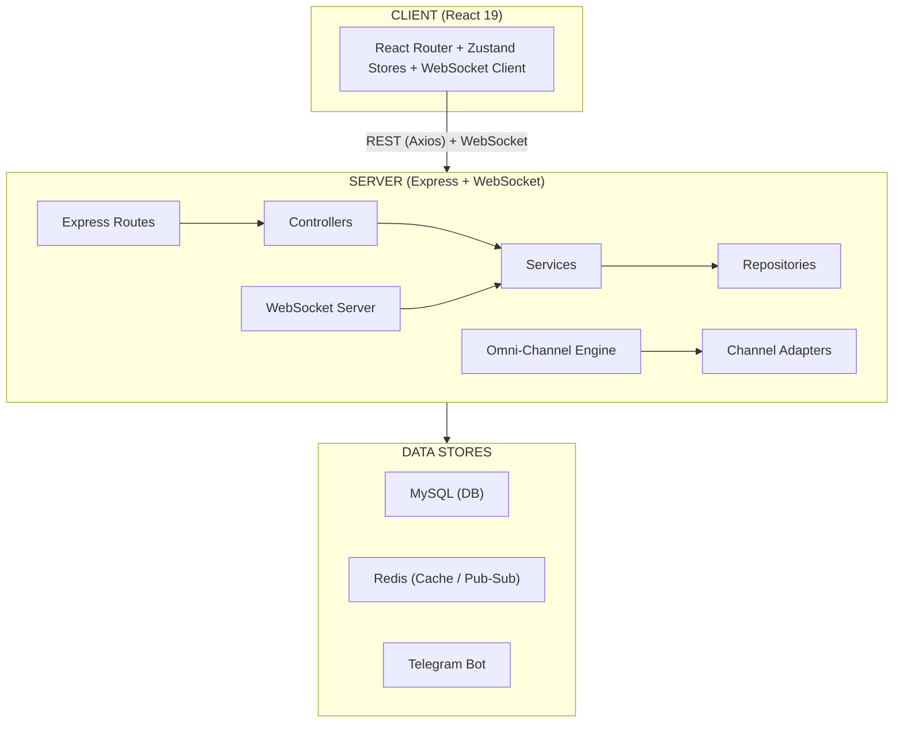

---

## 2. Monorepo Structure

```
chat_websocket/
├── .nvmrc                          # Node version (24)
├── package.json                    # Root workspace (kneachat)
├── .gitignore
├── README.md
├── docs/                           # Documentation
│
├── client/                         # React Frontend
│   ├── package.json
│   ├── tsconfig.json
│   ├── public/
│   └── src/
│       ├── index.tsx               # React entry
│       ├── App.tsx                 # Router + auth guards
│       ├── App.css
│       ├── app/                    # Application shell
│       │   ├── App.tsx             # Root component + route guards
│       │   ├── routes.ts           # Route definitions + role guards
│       │   ├── providers/          # ThemeProvider, ToastProvider
│       │   └── stores/             # Zustand stores barrel + wsListeners bridge
│       ├── entities/               # Domain modules (types + Zustand stores per feature)
│       │   ├── auth/               # Auth types + authStore
│       │   ├── conversation/       # Conversation types + chatStore (messages, typing, etc.)
│       │   ├── user/               # User types + userStore
│       │   ├── notification/       # Notification types + notificationStore
│       │   ├── company/            # Company/team/department types + companyStore
│       │   ├── announcement/       # Announcement types + announcementStore
│       │   ├── task/               # Task types + taskStore
│       │   ├── meeting/            # Meeting types + meetingStore
│       │   ├── attendance/         # Attendance types + attendanceStore
│       │   ├── file/               # Shared file types + sharedFileStore
│       │   └── ...                 # omni, search, system-setting, subscription, etc.
│       ├── features/               # Feature UI components (organized by domain)
│       │   ├── chat/               # MessageList, MessageComposer, ConversationList, ThreadPanel
│       │   ├── channels/           # ChannelsView, CreateChannelModal
│       │   ├── teams/              # TeamsView, CreateTeamModal, TeamModal
│       │   ├── announcements/      # AnnouncementsView
│       │   ├── notifications/      # NotifsView, NotificationMessageModal, reply/reaction actions
│       │   ├── settings/           # SettingsView
│       │   ├── files/              # SharedFilesView, FilePreview, FileShareModal, FileVersionHistory
│       │   ├── attendance/         # AttendanceView, ManagerAttendanceView, ClockControls, etc.
│       │   ├── meetings/           # MeetingsView, CreateMeetingModal, MeetingNoteModal
│       │   ├── tasks/              # TasksView, TaskDetailModal
│       │   ├── bookmarks/          # BookmarksView
│       │   ├── search/             # SearchModal, SearchView
│       │   ├── omni-inbox/         # OmniInboxView
│       │   └── calls/              # CallModal, IncomingCallModal, CallChatPanel
│       ├── pages/                  # Page-level layouts (role-based)
│       │   ├── auth/               # LoginPage, ForgotPasswordPage, ResetPasswordPage
│       │   ├── dashboard/          # DashboardPage (layout shell + sidebar navigation)
│       │   ├── admin/              # AdminPage
│       │   ├── super-admin/        # SuperAdminPage
│       │   ├── manager/            # ManagerPage
│       │   └── profile/            # ProfilePage
│       ├── shared/                 # Cross-cutting UI and utilities
│       │   ├── ui/                 # Avatar, Icon, Modal, Skeleton, EmptyState, ReactionBar, etc.
│       │   ├── lib/                # api.ts (Axios client), websocket.ts (WebSocket singleton), webrtc.ts
│       │   └── stores/             # callStore (cross-feature call state)
│       └── widgets/                # Reusable composite widgets
│           └── sidebar/            # Sidebar navigation component
│
└── server/                         # Express + WebSocket Backend
    ├── package.json
    ├── tsconfig.json
    ├── .env                        # Runtime secrets (DB, JWT, Telegram)
    ├── .env.example
    ├── e2e/                        # End-to-end test scripts
    │   ├── notifications.e2e.js
    │   ├── permissions.e2e.js
    │   ├── attendance.e2e.js
    │   ├── telegram-omni.e2e.js
    │   ├── avatar-upload.e2e.js
    │   ├── sessions.e2e.js
    │   ├── shared-files.e2e.js
    │   ├── tasks-notifications.e2e.js
    │   ├── search-browser.e2e.js
    │   ├── announcements-browser.e2e.js
    │   └── chat-upload.e2e.js
    ├── scripts/                    # DB init, seed, daemon
    │   └── kneachat-daemon.py
    └── src/
        ├── server.ts               # HTTP + WS server bootstrap
        ├── app.ts                  # Express app (middleware, routes)
        ├── container.ts            # Composition root (DI wiring)
        ├── database/
        │   └── connection.ts       # MySQL pool + query helpers
        ├── cache/
        │   └── redisClient.ts      # Redis client with memory fallback
        ├── middleware/
        │   ├── auth.middleware.ts  # JWT auth + role/capability checks
        │   └── error.middleware.ts # Global error handler
        ├── types/                  # Domain type definitions
        │   ├── index.ts
        │   ├── Auth.ts, User.ts, Message.ts, Conversation.ts, ...
        │   └── express.d.ts        # Augments Express Request with user
        ├── utils/
        │   ├── roles.ts            # RBAC hierarchy
        │   ├── permissions.ts      # Discretionary permission catalog
        │   ├── auth.utils.ts       # JWT + bcrypt helpers
        │   ├── errors.utils.ts     # DB error sanitization
        │   ├── mentions.utils.ts   # @-mention extraction
        │   └── plans.ts            # Subscription plan definitions
        ├── repositories/           # Data-access layer (SQL only)
        │   ├── userRepository.ts
        │   ├── messageRepository.ts
        │   ├── conversationRepository.ts
        │   └── ... (35+ repositories)
        ├── services/               # Business logic layer
        │   ├── Auth.service.ts
        │   ├── Message.service.ts
        │   ├── OmniChannel.service.ts
        │   └── ... (27 services)
        ├── controllers/            # MVC controller layer
        │   ├── auth.controller.ts
        │   ├── message.controller.ts
        │   ├── conversation.controller.ts
        │   └── ... (26 controllers)
        ├── routes/                 # Express route definitions
        │   ├── auth.routes.ts
        │   ├── message.routes.ts
        │   └── ... (25 route files)
        ├── websocket/              # WebSocket server
        │   ├── websocket.server.ts # ChatWebSocketServer class
        │   ├── message.handler.ts
        │   ├── typing.handler.ts
        │   ├── presence.handler.ts
        │   ├── call.handler.ts
        │   ├── broadcast.utils.ts
        │   ├── connection.registry.ts
        │   ├── attendance.events.ts
        │   └── workspace.events.ts
        └── integrations/           # Omni-channel adapters
            ├── telegram/
            │   ├── telegram.service.ts
            │   ├── telegram.adapter.ts
            │   ├── telegram.controller.ts
            │   ├── telegram.routes.ts
            │   └── telegram.types.ts
            ├── website/
            │   ├── website.adapter.ts
            │   ├── website.controller.ts
            │   └── website.routes.ts
            └── omni/
                ├── omni.types.ts
                ├── channelRegistry.ts
                ├── omni.controller.ts
                └── omni.routes.ts
```

---

## 3. Backend Architecture (Server)

### 3.1 Layered Architecture

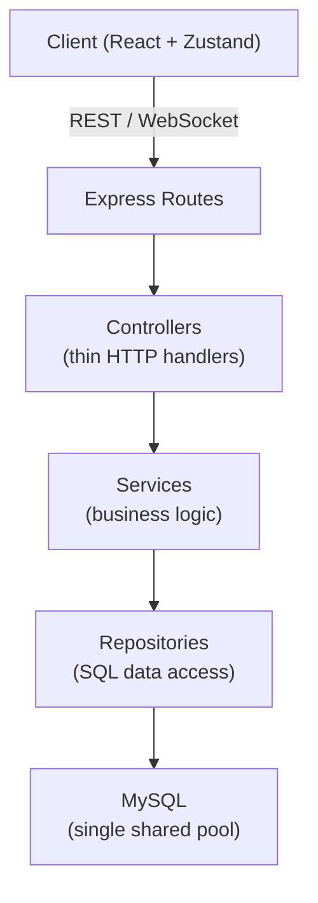

**Layers:**

| Layer | Location | Responsibility |
|-------|----------|----------------|
| Routes | `server/src/routes/` | URL definitions, mount controllers |
| Controllers | `server/src/controllers/` | Thin HTTP handlers, validate input |
| Services | `server/src/services/` | Business logic, orchestration |
| Repositories | `server/src/repositories/` | Raw SQL queries, data access |
| Database | `server/src/database/connection.ts` | MySQL connection pool |

### 3.2 Dependency Injection (Composition Root)

**File:** `server/src/container.ts`

`container.ts` is the **sole composition root**. It wires the entire dependency graph:

```
Db → Repositories → Services → Controllers / WebSocket Handlers
```

Every service, repository, controller, and WebSocket handler is instantiated here with constructor injection. No class constructs its own dependencies, making testing straightforward.

**Key exports:**

```typescript
export const container = {
  // db
  db,
  // repositories (35+)
  userRepository,
  messageRepository,
  conversationRepository,
  // ... all repositories
  // services (27)
  authService,
  messageService,
  omniService,
  // ... all services
  // controllers (26+)
  authController,
  messageController,
  // ... all controllers
  // websocket handlers
  messageHandler,
  typingHandler,
  presenceHandler,
  callHandler,
  chatWebSocketServer,
  // middleware
  auth,
};
```

### 3.3 Server Bootstrap Flow

**File:** `server/src/server.ts`

```
1. Load environment variables (dotenv/config)
2. Create HTTP server (http.createServer(app))
3. Attach WebSocket server (new WebSocket.Server({ server }))
4. Wire WebSocket handlers from container
5. Start background schedulers:
   - Reminder processor (every 30s)
   - Meeting reminder processor (every 30s)
   - Task deadline processor (every 30s)
   - Scheduled announcement processor (every 30s)
6. Start Redis attendance event relay
7. Listen on PORT (default 8080)
8. Handle SIGTERM for graceful shutdown
```

### 3.4 Express App Setup

**File:** `server/src/app.ts`

```
1. CORS middleware (configurable origins)
2. Body parsing (JSON + URL encoded)
3. Request logging
4. Static file serving (/uploads)
5. Public routes:
   - /api/auth (register, login, refresh, forgot/reset password)
   - /api/health
   - /api/omni (shared inbox actions)
   - /api/website (omni-channel website widget)
   - /api/telegram (omni-channel Telegram)
6. Protected routes (require authentication):
   - /api/users, /api/teams, /api/channels, /api/conversations
   - /api/messages, /api/notifications, /api/tasks
   - /api/meetings, /api/attendance, /api/shared-files
   - /api/companies, /api/departments, /api/announcements
   - /api/audit-logs, /api/company-settings, /api/subscriptions
   - /api/admin/metrics
   - /api/settings (with public GET for maintenance state)
7. 404 handler
8. Global error handler
```

---

## 4. Authentication & Authorization Flow

### 4.1 JWT Authentication

**File:** `server/src/middleware/auth.middleware.ts`

```
1. Client sends Authorization: Bearer <token> (REST) or ?token=<token> (WebSocket)
2. Server verifies JWT with secret
3. On success: attaches user to request (req.user) with:
   - id, email, role, companyId
4. Checks maintenance mode (blocks non-super_admin)
5. Calls next()
```

### 4.2 Role-Based Access Control (RBAC)

**File:** `server/src/utils/roles.ts`

**Role hierarchy (highest to lowest):**

```
super_admin > admin > manager > employee > external
```

**Middleware checks:**

| Middleware | Purpose |
|------------|---------|
| `authenticate` | Verify JWT, attach user to request |
| `authorize(allowedRoles)` | Exact role match |
| `authorizeAtLeast(minRole)` | Role hierarchy check |
| `authorizeCapability(permissionKey)` | Discretionary permission check |

### 4.3 Discretionary Permissions

**File:** `server/src/utils/permissions.ts`

Company admins can toggle capabilities for the manager role via `role_permissions` table:

| Permission Key | Description |
|----------------|-------------|
| `create_teams` | Create new teams |
| `manage_teams` | Update/delete teams |
| `manage_team_members` | Add/remove team members |
| `manage_channels` | Create/update/delete channels |
| `publish_announcements` | Create company-wide announcements |

---

## 5. Database Architecture

### 5.1 Connection Pool

**File:** `server/src/database/connection.ts`

- **Pool:** Single shared `mysql2/promise` pool
- **Connection limit:** 10
- **Keep-alive:** Enabled
- **Query method:** Text protocol (avoids prepared statement issues with LIMIT/OFFSET in MySQL 8.0.23+)
- **Transaction support:** `db.transaction(callback)` wraps begin/commit/rollback

### 5.2 Database Schema

**File:** Referenced in `server/src/types/`

| Table | Purpose |
|-------|---------|
| `users` | Internal users (including shadow `external` users for omni-channel) |
| `companies` | Company/tenant records |
| `company_settings` | Per-company feature policies |
| `role_permissions` | Discretionary capability overrides |
| `subscriptions` | Subscription plans + seat limits |
| `departments` | Department hierarchy |
| `user_sessions` | Authentication sessions + refresh tokens |
| `password_resets` | Password reset tokens |
| `system_settings` | Platform-wide feature flags |
| `audit_logs` | Audit trail |
| `conversations` | Direct, group, channel, team conversations |
| `conversation_members` | Conversation membership |
| `messages` | Soft-deleted messages |
| `attachments` | File attachments on messages |
| `message_reactions` | Emoji reactions on messages |
| `channels` | Public/private channels |
| `channel_members` | Channel membership |
| `teams` | Teams with leader/member roles |
| `team_members` | Team membership |
| `notifications` | User notifications with JSON data |
| `user_notification_preferences` | Per-user opt-outs by category |
| `announcements` | Targeted announcements (company/department/team) |
| `announcement_reactions` | Reactions on announcements |
| `announcement_reads` | Read tracking for announcements |
| `tasks` | Task management |
| `task_comments` | Comments on tasks |
| `task_attachments` | File attachments on tasks |
| `task_reactions` | Reactions on tasks |
| `meetings` | Meeting lifecycle |
| `meeting_attendees` | Meeting attendees + RSVP |
| `meeting_notes` | Meeting notes |
| `meeting_reminders` | Meeting reminders |
| `meeting_attachments` | Meeting file attachments |
| `work_schedules` | Work schedule definitions |
| `attendance_records` | Daily attendance records |
| `break_records` | Break records |
| `leave_requests` | Leave request management |
| `holidays` | Holiday definitions |
| `overtime_records` | Overtime tracking |
| `shared_files` | Shared file metadata |
| `file_versions` | File version history |
| `file_permissions` | File access permissions |
| `file_shares` | File share links |
| `bookmarks` | Message bookmarks |
| `reminders` | Message reminders |
| `external_contacts` | Omni-channel external contacts |
| `external_conversations` | Omni-channel external conversations |
| `external_messages` | Omni-channel external message ledger |
| `platform_metrics` | Platform-wide metrics |

---

## 6. WebSocket Real-Time Pipeline

### 6.1 WebSocket Server

**File:** `server/src/websocket/websocket.server.ts`

**Class:** `ChatWebSocketServer`

**Connection flow:**
```
1. Client connects: ws://host:port?token=<JWT>
2. Server extracts token from query string
3. Server verifies JWT
4. On success:
   - Attaches userId, email, role, companyId to socket
   - Registers in connection.registry (userConnections Map)
   - Sends connection_ack to client
   - Broadcasts user_online to all connected clients
   - Sends presence snapshot to newly connected client
5. On failure:
   - Closes connection with code 4001
```

**Event routing:**
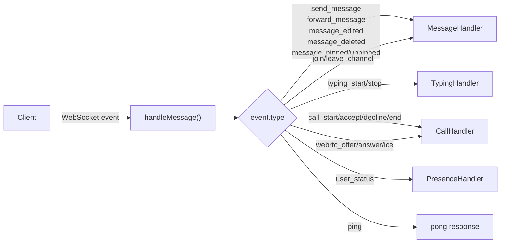

### 6.2 Connection Registry

**File:** `server/src/websocket/connection.registry.ts`

```typescript
userConnections: Map<number, AuthedSocket[]>  // userId → [sockets]

sendToUser(userId, event)  // Send to all sockets of a user
getConnectedUsers()         // Get all online user IDs
isUserConnected(userId)     // Check if user has active connections
```

### 6.3 WebSocket Handlers

**Message Handler** (`message.handler.ts`)
- Handles: send_message, forward_message, message_edited, message_deleted, message_pinned/unpinned
- Persists via MessageService
- Broadcasts to conversation members via broadcastToConversation

**Typing Handler** (`typing.handler.ts`)
- Handles: typing_start, typing_stop
- Broadcasts to other conversation members

**Presence Handler** (`presence.handler.ts`)
- Handles: user_status change
- Broadcasts online/offline/presence snapshot to all clients

**Call Handler** (`call.handler.ts`)
- Handles: call_start, call_accept, call_decline, call_end
- Relays WebRTC signaling (offer/answer/ICE)
- Tracks active calls, records missed calls

### 6.4 Broadcast Utilities

**File:** `server/src/websocket/broadcast.utils.ts`

```typescript
broadcastToConversation(conversationId, event, options?)
  - Resolves conversation members via DB
  - Sends to each member's connected sockets
  - Optionally excludes a user (e.g., sender)

broadcastToAll(event)
  - Sends to all connected sockets
```

### 6.5 Cross-Instance Events (Redis)

**File:** `server/src/websocket/attendance.events.ts`

- Publishes attendance events to Redis pub/sub
- Allows clock-in/out events to fan out to other server instances
- Starts Redis subscription relay on server boot

### 6.6 Client WebSocket Service

**File:** `client/src/shared/lib/websocket.ts`

**Class:** `WebSocketService` (singleton)

```
Features:
- Connection management (single socket, reuse on reconnect)
- JWT token authentication (query parameter)
- Exponential backoff reconnection (max 8 attempts, base 1s)
- Heartbeat (ping/pong every 15s, 5s timeout)
- Event queuing (messages queued while disconnected)
- Typed event map (WsEventMap) for type safety
- Listener management (on/off/emit)
```

**Reconnection flow:**
```
1. Socket closes unexpectedly
2. Emit 'connection' event with 'reconnecting' status
3. Wait: 1s, 2s, 4s, 8s, 16s, 32s, 64s (max 8 attempts)
4. Reconnect with stored token
5. On success: flush queued messages, reset counter
6. On failure after max attempts: emit 'disconnected'
```

### 6.7 WebSocket → Zustand Bridge

**File:** `client/src/app/stores/wsListeners.ts`

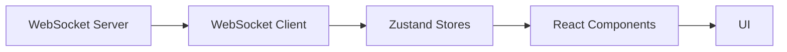

Registers listeners once from `App.tsx`. Dispatches events to Zustand stores:

```
WebSocket Server → WebSocket Client → Zustand Stores → React Components → UI

Events dispatched:
- receive_message → chatStore
- message_sent_ack → chatStore
- message_updated/deleted → chatStore
- typing_start/stop → chatStore
- user_online/offline → userStore
- incoming_call → callStore
- notification → notificationStore
- announcement_created/updated/deleted → announcementStore
- task_reacted/unreacted → taskStore
- shared_file_created/updated/deleted → sharedFileStore
- meeting_created/updated/cancelled → meetingStore
- attendance:clocked_in/out → attendanceStore
- omni_assignment_changed → chatStore (refresh conversations)
- workspace_changed → chatStore/companyStore (refresh teams/channels)
```

---

## 7. Omni-Channel Architecture

### 7.1 Overview

Omni-channel enables external communication channels (Telegram, website widget) to be managed within KneaChat. External messages appear in a unified "Omni Inbox" alongside internal chat.

### 7.2 ChannelAdapter Interface

**File:** `server/src/integrations/omni/omni.types.ts`

```typescript
interface ChannelAdapter {
  readonly channel: string;  // e.g., 'telegram', 'website'
  
  parseInbound(payload: unknown): Promise<OmniInboundMessage[]>;
  downloadMedia?(media: OmniMedia): Promise<Buffer | null>;
  sendMessage(chatId: number, text: string, options?): Promise<OmniOutboundResult>;
  // Optional file/voice relay (Telegram: sendPhoto/sendVoice/sendDocument).
  // Channels without it answer 400 "does not support media delivery".
  sendMedia?(chatId: number, media: OmniOutboundMedia, options?): Promise<OmniOutboundResult>;
  getHealth(): Promise<OmniHealthResult>;
  setupWebhook?(webhookUrl: string): Promise<unknown>;
  getWebhookInfo?(): Promise<unknown>;
  deleteWebhook?(): Promise<unknown>;
}
```

### 7.3 Channel Registry

**File:** `server/src/integrations/omni/channelRegistry.ts`

```typescript
class ChannelRegistry {
  register(adapter: ChannelAdapter): void
  get(channel: string): ChannelAdapter | undefined
  channels(): string[]
}
```

### 7.4 OmniChannelService

**File:** `server/src/services/OmniChannel.service.ts`

**Inbound flow:**
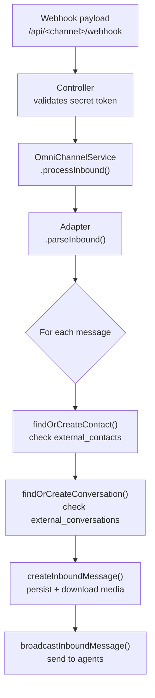

**Outbound flow (agent reply):**
```
1. Agent sends reply via REST API
2. OmniChannelService.sendAgentReply(conversationId, agentId, text)
3. Find external conversation + contact
4. Resolve chatId from external_contact_id
5. Map internal replyToMessageId → external message id (if replying)
6. adapter.sendMessage(chatId, text, options)
7. On success:
   - Persist outbound message to messages table
   - Create external_message ledger row
   - Broadcast to inbox members
   - Create notifications
```

**Assignment flow:**
```
1. Agent claims/unclaims conversation
2. OmniChannelService.assignAgent(conversationId, requesterId, agentId)
3. Validate requester + assignee are conversation members
4. Update external_conversations.assigned_agent_id
5. Broadcast omni_assignment_changed to all inbox members
```

### 7.5 Telegram Integration

**Files:**
- `server/src/integrations/telegram/telegram.service.ts` — Bot API client
- `server/src/integrations/telegram/telegram.adapter.ts` — ChannelAdapter implementation
- `server/src/integrations/telegram/telegram.controller.ts` — HTTP handlers
- `server/src/integrations/telegram/telegram.routes.ts` — Route definitions
- `server/src/integrations/telegram/telegram.types.ts` — TypeScript interfaces

**Supported media types:**
- Text messages
- Photos
- Voice messages
- Documents
- Videos
- Audio files
- Animations
- Stickers

**Routes:**
- `POST /api/telegram/webhook` — Public webhook (validates X-Telegram-Bot-Api-Secret-Token)
- `GET /api/telegram/health` — Public health check
- `POST /api/telegram/messages` — Authenticated agent reply
- `POST /api/telegram/assign` — Authenticated assignment
- `POST /api/telegram/webhook/setup` — Authenticated webhook setup
- `GET /api/telegram/webhook/info` — Authenticated webhook info
- `DELETE /api/telegram/webhook` — Authenticated webhook delete

### 7.6 Website Integration

**Files:**
- `server/src/integrations/website/website.adapter.ts` — ChannelAdapter implementation
- `server/src/integrations/website/website.controller.ts` — HTTP handlers
- `server/src/integrations/website/website.routes.ts` — Route definitions

**Routes:**
- `POST /api/website/webhook` — Public webhook
- `GET /api/website/health` — Public health check
- `POST /api/website/messages` — Authenticated agent reply
- `POST /api/website/assign` — Authenticated assignment

---

## 8. Client-Side Architecture

### 8.1 Feature-based Organization

The client is organized by **feature domain** rather than by architectural layer. Each feature owns its types, state management, and UI in a single cohesive unit.

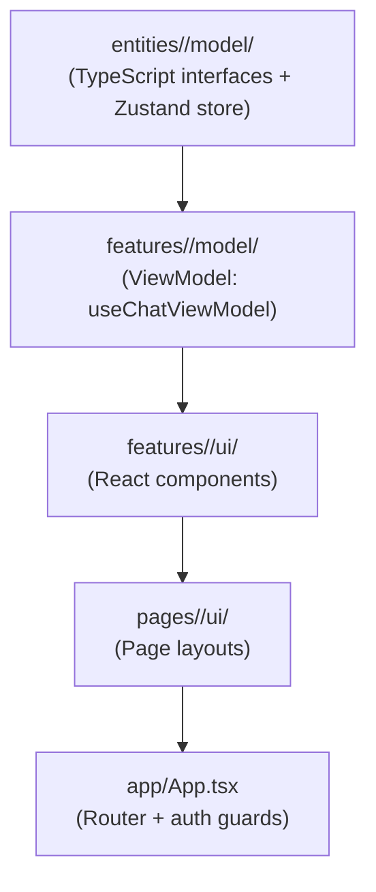

**Top-level layout:**

| Directory | Responsibility |
|-----------|----------------|
| `client/src/app/` | Application shell: `App.tsx` (router + guards), `routes.ts` (route config), `providers/` (Theme, Toast), `stores/` (Zustand barrel + `wsListeners.ts`) |
| `client/src/entities/` | Domain modules: each feature folder contains `model/` with TypeScript interfaces and a Zustand store (e.g. `authStore.ts`, `chatStore.ts`, `attendanceStore.ts`) |
| `client/src/features/` | Feature UI: each feature folder contains `ui/` with React components and optionally `model/` with a ViewModel hook (e.g. `useChatViewModel.ts`) |
| `client/src/pages/` | Page layouts: role-based top-level pages (`auth/`, `dashboard/`, `admin/`, `super-admin/`, `manager/`, `profile/`) |
| `client/src/shared/` | Cross-cutting concerns: `ui/` (Avatar, Icon, Modal, Skeleton, etc.), `lib/` (`api.ts`, `websocket.ts`, `webrtc.ts`), `stores/` (`callStore.ts`) |
| `client/src/widgets/` | Reusable composite widgets (e.g. `sidebar/`) |

### 8.2 Entity Stores (Zustand)

Each entity module in `client/src/entities/<feature>/model/` exports a domain type and a Zustand store:

| Store | Location | State |
|-------|----------|-------|
| `useAuthStore` | `entities/auth/model/authStore.ts` | User, token, loading, error |
| `useChatStore` | `entities/conversation/model/chatStore.ts` | Conversations, messages, typing, bookmarks, reminders, connection status |
| `useUserStore` | `entities/user/model/userStore.ts` | Users list, online users, presence status |
| `useNotificationStore` | `entities/notification/model/notificationStore.ts` | Notifications list, unread count |
| `useCompanyStore` | `entities/company/model/companyStore.ts` | Teams, departments, company settings |
| `useCallStore` | `shared/stores/callStore.ts` | Active call, WebRTC signaling |
| `useMeetingStore` | `entities/meeting/model/meetingStore.ts` | Meetings, notes, reminders, attendees |
| `useAnnouncementStore` | `entities/announcement/model/announcementStore.ts` | Announcements, reactions, read tracking |
| `useTaskStore` | `entities/task/model/taskStore.ts` | Tasks, reactions |
| `useAttendanceStore` | `entities/attendance/model/attendanceStore.ts` | Attendance records, breaks, dashboard |
| `useSharedFileStore` | `entities/file/model/sharedFileStore.ts` | Shared files, versions, permissions |

### 8.3 WebSocket Client

**File:** `client/src/shared/lib/websocket.ts`

```
WebSocketService (singleton)
├── connect(token)
│   ├── Reuse existing socket if OPEN/CONNECTING
│   ├── Create new WebSocket with token in query
│   ├── Start heartbeat (ping every 15s)
│   └── Flush queued messages
├── disconnect()
│   ├── Stop heartbeat
│   ├── Clear reconnection timer
│   └── Close socket
├── send(eventType, data)
│   ├── If OPEN: send immediately
│   └── Else: queue for later
├── on(event, handler) / off(event, handler)
│   └── Event listener management
└── emit(event, data)
    └── Dispatch to all registered handlers
```

### 8.4 WebSocket → Zustand Bridge

**File:** `client/src/app/stores/wsListeners.ts`

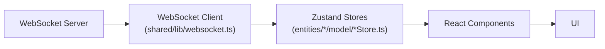

Subscribes once from `App.tsx`. Dispatches events to Zustand stores:

```
WebSocket Server → WebSocket Client → Zustand Stores → React Components → UI

Events dispatched:
- receive_message → chatStore
- message_sent_ack → chatStore
- message_updated/deleted → chatStore
- typing_start/stop → chatStore
- user_online/offline → userStore
- incoming_call → callStore
- notification → notificationStore
- announcement_created/updated/deleted → announcementStore
- task_reacted/unreacted → taskStore
- shared_file_created/updated/deleted → sharedFileStore
- meeting_created/updated/cancelled → meetingStore
- attendance:clocked_in/out → attendanceStore
- omni_assignment_changed → chatStore (refresh conversations)
- workspace_changed → chatStore/companyStore (refresh teams/channels)
```

---

## 9. Key Workflows

### 9.1 User Registration & Login

```
1. POST /api/auth/register
   - Validate input
   - Hash password (bcrypt)
   - Create user in DB
   - Return user + token

2. POST /api/auth/login
   - Validate credentials
   - Generate JWT (with id, email, role, companyId)
   - Create session record
   - Return token + user

3. Client stores token
4. Client connects WebSocket: ws://host?token=<token>
5. Server verifies JWT, registers socket
6. Server sends connection_ack
7. Client emits connection_ack → update connection status
```

### 9.2 Sending a Message

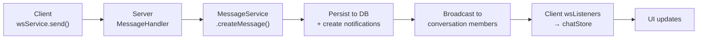

### 9.3 Receiving a Message (Real-time)

```
1. Sender sends message via WebSocket
2. Server persists + broadcasts
3. Recipient's WebSocket receives 'receive_message' event
4. wsListeners receives event → chatStore.addMessage(convId, message)
5. React component re-renders with new message
6. If message is in unread conversation:
   - notificationStore.refresh() updates unread count
```

### 9.4 Typing Indicator

```
1. User types in conversation
2. Client: wsService.send('typing_start', { conversationId })
3. Server: TypingHandler.handleTypingStart()
4. Server broadcasts 'typing_start' to other conversation members
5. Recipient's wsListeners → chatStore.setTyping(convId, userId, true)
6. UI shows "X is typing..."
7. After 3s inactivity: client sends 'typing_stop'
```

### 9.5 Voice/Video Call

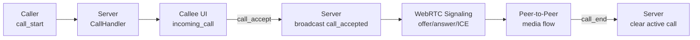

### 9.6 Omni-Channel Inbound (Telegram)

```
1. User sends message to Telegram bot
2. Telegram sends webhook to /api/telegram/webhook
3. TelegramController validates X-Telegram-Bot-Api-Secret-Token
4. Calls OmniChannelService.processInbound('telegram', payload)
5. TelegramAdapter.parseInbound(payload) → [OmniInboundMessage]
6. OmniChannelService:
   a. findOrCreateContact() — creates shadow user if new
   b. findOrCreateConversation() — creates conversation + joins agents
   c. createInboundMessage() — persists message + attachment + notification
   d. broadcastInboundMessage() — sends 'receive_message' to agents
7. Agents see new message in Omni Inbox (real-time via WebSocket)
```

### 9.7 Agent Reply (Omni-Channel)

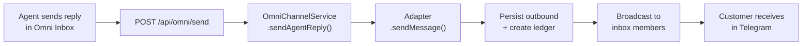

### 9.8 Attendance Clock-In/Out

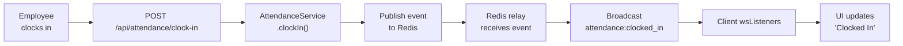

---

## 10. Background Schedulers

**File:** `server/src/server.ts`

Four `setInterval` schedulers run every 30 seconds:

| Scheduler | Service | Purpose |
|-----------|---------|---------|
| Reminder processor | `reminderService.processDueReminders()` | Send message reminders |
| Meeting reminder processor | `meetingService.processDueMeetingReminders()` | Send meeting reminders |
| Task deadline processor | `taskService.processDueTaskDeadlines()` | Alert on task deadlines |
| Scheduled announcement processor | `announcementService.processDueScheduledAnnouncements()` | Flip pending announcements live |

---

## 11. Testing Strategy

### 11.1 Unit Tests (Client)

- **Framework:** Jest + React Testing Library
- **Coverage:** Stores, components, utilities, WebSocket service
- **Files:** `client/src/**/*.test.ts`, `client/src/**/*.test.tsx`

### 11.2 End-to-End Tests (Server)

- **Framework:** Node.js + `ws` library + `fetch`
- **Pattern:** Standalone scripts that authenticate, perform REST + WebSocket actions, assert on responses, then clean up
- **Files:** `server/e2e/*.e2e.js`

**E2E test flows:**
- `notifications.e2e.js` — Two-window WebSocket scenario
- `permissions.e2e.js` — Role matrix verification
- `attendance.e2e.js` — Clock in/out, breaks, dashboard
- `telegram-omni.e2e.js` — Telegram omni-channel flow
- `avatar-upload.e2e.js` — Avatar upload + live broadcast
- `sessions.e2e.js` — Session management
- `shared-files.e2e.js` — File upload, versions, permissions
- `tasks-notifications.e2e.js` — Task creation + notification
- `search-browser.e2e.js` — Global search
- `announcements-browser.e2e.js` — Announcement + reactions
- `chat-upload.e2e.js` — Chat file upload

**Cleanup pattern:** Marker-based SQL deletes (bypasses FK constraints by deleting in dependency order)

---

## 12. Key Architectural Patterns

### 12.1 Dependency Injection

- `container.ts` is the **sole composition root**
- Every service, repository, controller, and handler receives dependencies via constructor
- Tests can substitute stubs easily

### 12.2 Single Responsibility

- **Controllers:** Thin HTTP handlers, no business logic
- **Services:** All business logic, orchestration
- **Repositories:** Raw SQL queries only
- **Handlers:** WebSocket event routing

### 12.3 Event-Driven Real-Time

- Server broadcasts events to connected clients
- Client maintains event listeners via `wsService.on()`
- `wsListeners.ts` bridges WebSocket events to Zustand stores
- UI components subscribe to store changes

### 12.4 Adapter Pattern (Omni-Channel)

- `ChannelAdapter` interface defines the contract
- Each channel implements the interface
- `OmniChannelService` is channel-agnostic
- Adding a new channel = register one more adapter

### 12.5 Caching

- **Redis:** Primary cache for system settings, attendance pub/sub
- **Memory fallback:** `redisClient.ts` provides transparent in-memory fallback when Redis is unavailable
- **Client-side:** Zustand stores cache API responses

### 12.6 Error Handling

- **Global error handler** (`error.middleware.ts`) sanitizes DB errors
- **`errors.utils.ts`** provides `isDatabaseError`, `getSafeErrorMessage`
- Services throw plain `Error` or objects with `statusCode`
- Controllers map to appropriate HTTP responses

---

## 13. Environment Configuration

**File:** `server/.env`

| Variable | Purpose |
|----------|---------|
| `DB_HOST`, `DB_PORT`, `DB_USER`, `DB_PASSWORD`, `DB_NAME` | MySQL connection |
| `JWT_SECRET` | JWT signing secret |
| `CORS_ORIGIN` | Allowed CORS origins (comma-separated) |
| `PORT`, `HOST` | Server listen address |
| `NODE_ENV` | Environment (development/production) |
| `TELEGRAM_BOT_TOKEN` | Telegram bot token |
| `TELEGRAM_WEBHOOK_SECRET` | Telegram webhook validation secret |
| `UPLOAD_DIR` | File upload directory |
| `REDIS_URL` | Redis connection (optional, falls back to memory) |
| `OMNI_INBOX_AGENT_IDS` | Restrict omni inbox to specific users (comma-separated) |
| `TELEGRAM_INBOX_AGENT_IDS` | Legacy alias for OMNI_INBOX_AGENT_IDS |

---

## 14. Running the Project

### 14.1 Prerequisites

- Node.js 24 (`.nvmrc`)
- MySQL 8.0+
- Redis (optional, for pub/sub)
- Telegram bot token (optional, for omni-channel)

### 14.2 Setup

```bash
# Install dependencies
npm run install:client
npm run install:server

# Configure environment
cp server/.env.example server/.env
# Edit server/.env with your settings

# Initialize database
cd server
npm run db:init
npm run db:seed

# Run development
npm run dev
```

### 14.3 Scripts

| Script | Purpose |
|--------|---------|
| `npm run dev` | Run client + server concurrently |
| `npm run client` | Run React dev server (port 3000) |
| `npm run server` | Run Express + WebSocket server (port 8080) |
| `npm run build` | Build both client + server |
| `npm run test` | Run all tests |
| `npm run db:init` | Initialize database schema |
| `npm run db:seed` | Seed demo data |

---

## 15. Summary

KneaChat is a **real-time workplace communication platform** built with a clean, layered architecture and designed for extensibility.

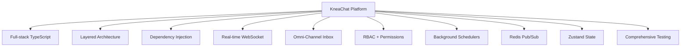

**Key characteristics:**

- **Full-stack TypeScript** — Type safety across client and server
- **Layered architecture** — Routes → Controllers → Services → Repositories
- **Dependency injection** — Single composition root (`container.ts`)
- **Real-time WebSocket** — Presence, messaging, typing, calls
- **Omni-channel inbox** — Telegram + website widget via adapter pattern
- **RBAC + discretionary permissions** — Role hierarchy + per-company capability overrides
- **Background schedulers** — Reminders, meetings, tasks, announcements
- **Redis pub/sub** — Cross-instance event fan-out
- **Zustand state management** — Client-side reactive state
- **Comprehensive testing** — Unit tests (client) + E2E tests (server)

The codebase is well-structured, follows consistent patterns, and is designed for extensibility (adding new channels, features, or integrations requires minimal changes to existing code).
